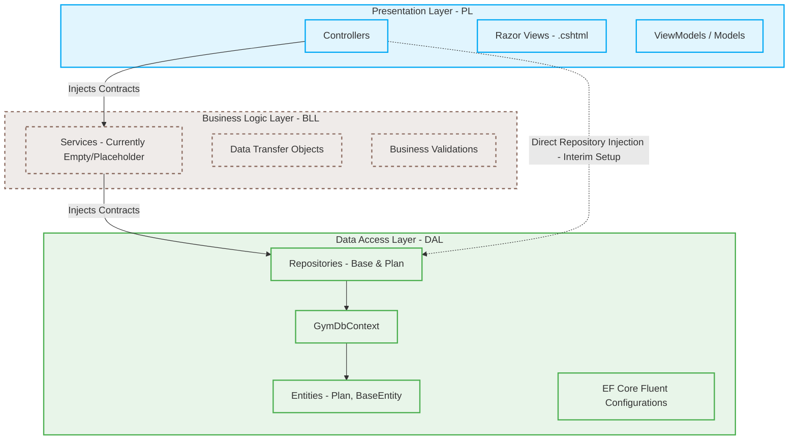

# Architectural Specifications (architecture.md)

This document provides a comprehensive analysis and technical blueprint of the Gym Management System's architecture, layers, dependencies, and communication patterns. It serves as an onboarding guide and architectural guardrail for developers and AI agents alike.

---

## 🏛️ Layered (N-Tier) Architecture Overview

The application is structured into three decoupled layers to enforce separation of concerns, enhance maintainability, and ensure scalability. 



---

## 📂 Deep Dive into Layers

### 1. Presentation Layer (PL): `codewithmena.GymManagementSystem`
The PL is built on **ASP.NET Core 10.0 MVC (Model-View-Controller)**. It is responsible for serving the user interface, handling incoming HTTP requests, managing routing, and binding dynamic models to Razor Views.

-   **Responsibility:** Visual presentation, input routing, local session management.
-   **Dependencies:** References both `BLL` and `DAL`.
-   **Critical Components:**
    -   `Program.cs`: The modern .NET 10 entry point. Configures dependency injection (DI) scopes, reads connection strings, registers `DbContext` with SQL Server, sets up static assets caching pipeline, and defines the default MVC controller route.
    -   `Controllers/`: Contain actions that orchestrate requests. Currently, the `PlansController` injects `IPlanRepository` directly to query/modify data due to the empty BLL.
    -   `Views/`: Server-side HTML templates (Razor). Uses strong model typing (`@model`) and tag helpers to build highly visual, secure markup.
    -   `wwwroot/`: The root directory for static web files, featuring highly optimized custom styling in `css/style.css` and local library resources (Bootstrap 5, jQuery).

### 2. Business Logic Layer (BLL): `codewithmena.GymManagementSystem.BLL`
The BLL serves as the intermediary coordinator between the UI layer and the persistent database layer. 

-   **Responsibility:** Executes domain logic, business validations, calculation rules, user permission checks, and transactional flows. It prevents presentation concerns from bleeding into the database, and vice versa.
-   **Dependencies:** References `DAL`.
-   **Current State (Interim Shortcut):**
    -   Currently, the BLL is an empty project scaffolding (containing only its `.csproj` file).
    -   To bypass this, controllers currently communicate directly with the database via DAL repositories.
-   **Future Architectural Goal (De-coupling):**
    -   AI Agents should transition the system to a clean pattern where Controllers **only** inject BLL Services (e.g., `IPlanService`).
    -   The service layer executes validations and maps rich DB `Entities` into lighter `DTOs` or UI-specific `ViewModels` before passing them back to the Presentation Layer.

### 3. Data Access Layer (DAL): `codewithmena.GymManagementSystem.DAL`
The DAL isolates all persistence mechanics from the rest of the application. It is powered by **Entity Framework Core 10.0 (EF Core)** and follows a structured Repository Pattern.

-   **Responsibility:** Database connections, queries, object-relational mapping (ORM), migrations, and transactional saves.
-   **Dependencies:** Self-contained; has zero awareness of the BLL or PL.
-   **Critical Components:**
    -   `DbContexts/GymDbContext.cs`: The master context. Integrates Fluent configurations dynamically via `modelBuilder.ApplyConfigurationsFromAssembly` to keep the context clean.
    -   `Entities/`: Plain Old CLR Objects (POCO) mapping directly to database tables. Employs a generic `BaseEntity<TKey>` to standardize auditing (`CreatedAt`, `UpdatedAt`) and soft deletion (`IsDeleted`).
    -   `Configurations/`: Houses Fluent API mapping files (inheriting from `BaseEntityConfiguration<TEntity, TKey>`) to dictate schema rules, primary/foreign keys, precision, nullability, and database-level constraints.
    -   `Contracts/Repositories/`: Standard interfaces for repository structures to decouple implementation from definition.
    -   `Repositories/`: Standardized CRUD concrete implementations. Features `BaseRepository` that handles soft deletes automatically during queries and updates, and concrete repositories like `PlanRepository` for domain-specific database requests.

---

## 📡 Cross-Cutting Architectural Patterns

### 1. Dependency Injection (DI)
The system relies heavily on constructor injection. Lifetimes are managed in `Program.cs`:
-   **DbContext:** Registered via `AddDbContext<GymDbContext>` (Scoped).
-   **Repositories:** Registered as **Scoped** (e.g., `builder.Services.AddScoped<IPlanRepository, PlanRepository>()`), ensuring a single repository instance is shared across a single HTTP request pipeline and disposed of afterward.

### 2. Soft-Deletion (Safety Net)
Instead of deleting records on disk, the system marks database rows with an `IsDeleted = 1` bit flag.
-   **Retrieval:** The `BaseRepository<T, Key>` automatically filters out rows with `IsDeleted` set to `true` during standard reads (`GetAllAsync` and `GetByIdAsync`).
-   **Deletion:** Calling `Delete(entity)` updates `IsDeleted` and sets `UpdatedAt`, avoiding hard destructive updates.

### 3. Configuration Discovery
To avoid a cluttered `OnModelCreating` method inside `GymDbContext`, EF Core's assembly scanning is used:
```csharp
protected override void OnModelCreating(ModelBuilder modelBuilder)
{
    modelBuilder.ApplyConfigurationsFromAssembly(Assembly.GetExecutingAssembly());
    base.OnModelCreating(modelBuilder);
}
```
This guarantees that any configuration file implementing `IEntityTypeConfiguration<T>` in the DAL project is loaded automatically.
